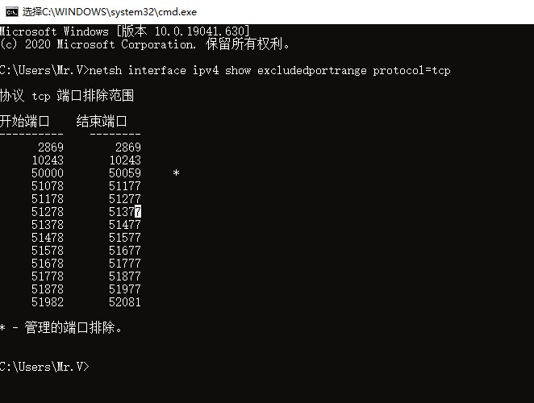

[pycharm不为人知的功能们](https://www.cnblogs.com/justaman/p/12452172.html)


gist

- 直接对想要创建gist的文件右键：create gist
- 需要先登陆
  - 使用token登录，需要先创建token
    - 个人中心 - settings-developer settings - Personal access tokens - Generate new token
    - 给权限：repo / read:org / gist
  - token只会在创建后显示一次，需要记下来(notion-search)
- 好处是一键即可创建gist
- pycharm会记住token，之后直接创建即可


### 版本

2020.2

- 支持python3.9
- 自动检测新安装的模块
- 文件提示，如open()函数
  - 在代码中的文件名称
- jupyter支持增强
- 太占内存了，不跑代码2G


2019.2

- 支持python3.8


### 破解

[zhile](https://zhile.io/)

破解现在不稳定，所以不破解（2020/11/27）


### 无法打开：端口绑定

参考：[Hyper-V和IDEA运行端口占用问题](https://blog.csdn.net/zzlve/article/details/105450928)


idea打开时会使用端口：6942-6991中的一个，如果这些端口都被使用了，则无法打开

- [官方说明](https://intellij-support.jetbrains.com/hc/en-us/community/posts/360006880600-IDEA-Start-Failed-Address-already-in-use)

原因及解决

- [github](https://github.com/docker/for-win/issues/3171)

- Windows系统默认的tcp动态端口范围为：1024~13977

  - 查看命令：`netsh int ipv4 show dynamicport tcp`

    ```bash
    C:\Users\Mr.V>netsh int ipv4 show dynamicport tcp
    
    协议 tcp 动态端口范围
    ---------------------------------
    启动端口        : 1024
    端口数          : 13977
    ```

- 而当开启Hyper-V后，系统默认会分配给一些保留端口供Hyper-V使用

  - 查看命令：`netsh interface ipv4 show excludedportrange protocol=tcp`

    ```bash
    C:\Users\Mr.V>netsh interface ipv4 show excludedportrange protocol=tcp
    协议 tcp 端口排除范围
    
    开始端口    结束端口
    ----------    --------
          2869        2869
          5357        5357
          6602        6701
          6918        7017
          7026        7125
          7329        7428
          9388        9487
          9488        9587
          9588        9687
         10243       10243
         11780       11879
         12480       12579
         12580       12679
         50000       50059     *
    
    * - 管理的端口排除。
    ```

- 解决：

  - 更改tcp默认端口范围

    ```bash
    C:\Users\Mr.V> netsh int ipv[46] set dynamic tcp start=49152 num=16384
    完成
    ```
  
  
  
  - 重启后
  
    
  
  - 可以看到idea需要的6942-6991端口，不在tcp保留端口范围内
  
  - 后续的重启，idea所需端口均不再保留范围内，保留端口前面两个固定，之后从5000开始，所以至此就解决了端口占用的问题


