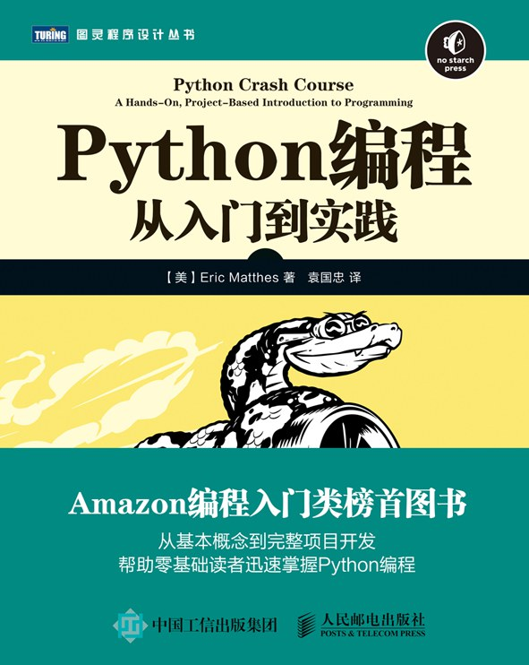

1.[Python编程 : 从入门到实践](https://book.douban.com/subject/26829016/) 

2.[Python Cookbook（第3版）](https://book.douban.com/subject/26381341/) 

- [线上-github](https://github.com/yidao620c/python3-cookbook)
- [线上-电子书](https://python3-cookbook.readthedocs.io/zh_CN/latest/index.html)

3.[流畅的Python](https://book.douban.com/subject/27028517/) 

