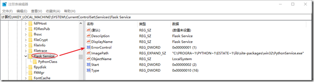
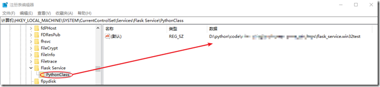

参看：[flask-windows](https://www.cnblogs.com/justaman/p/11914886.html)

### 安装

python实现windows服务需要借助第三方库pywin32

- pywin32基于pypiwin32，pypiwin32已经过期，现在使用pywin32

安装pywin32

```
pip install pywin32
```


### 使用

pywin32-win32service使用

pywin32：

- [pywin32文档](http://timgolden.me.uk/pywin32-docs/win32service.html)
- [win32service-api示例-腾讯云博客](https://cloud.tencent.com/developer/article/1569941)
- [创建service示例-博客](https://play.pixelblaster.ro/blog/2006/08/23/creating-and-managing-a-windows-service-part-2/)

微软原生接口：

- [创建服务](https://docs.microsoft.com/en-us/windows/win32/api/winsvc/nf-winsvc-createservicea)
- [guidelines-for-services--ChangeServiceConfig2](https://docs.microsoft.com/en-us/windows/win32/rstmgr/guidelines-for-services)
- [异常处理](https://docs.microsoft.com/en-us/windows/win32/api/winsvc/ns-winsvc-service_failure_actionsa)


#### 服务脚本（以flask服务为例）

- 首先编写flask_app.py，略

- 然后编写服务脚本，在其中调用flask_app

```python
# -*- coding: utf-8 -*-

import sys
import os

import servicemanager
import win32serviceutil
import win32service
import win32event
from manager import app

# 解决提示服务开启后又被关闭的问题
# 不写会提示：The instance's SvcRun() method failed <Error getting traceback - traceback.print_exception() failed %2: %3
sys.stdout = sys.stderr = open(os.devnull, 'w')

class win32test(win32serviceutil.ServiceFramework):
    _svc_name_ = "Flask Service"
    _svc_display_name_ = "Flask Service"
    _svc_description_ = "Flask Service"

    def __init__(self, args):
        win32serviceutil.ServiceFramework.__init__(self, args)
        # 创建停止信号事件
        self.hWaitStop = win32event.CreateEvent(None, 0, 0, None)
	
    # 服务启动时执行
    def SvcDoRun(self):
        # 调用自定义的main方法
        self.main()
        win32event.WaitForSingleObject(self.hWaitStop, win32event.INFINITE)

    # 当收到停止信号后会执行此方法
    def SvcStop(self):
        # 其实SERVICE_STOP_PENDING可有可无
        self.ReportServiceStatus(win32service.SERVICE_STOP_PENDING)
        # 不需要win32event.SetEvent(self.hWaitStop)
        # ！必须在停止服务方法中报告SERVICE_STOPPED，否则无法停止
        self.ReportServiceStatus(win32service.SERVICE_STOPPED)
	
    # 在其中启动flask_app
    # 注：debug必须为False，否则无法启动
    def main(self):
        app.run(host="0.0.0.0", port=5000, debug=False)


if __name__ == '__main__':
    win32serviceutil.HandleCommandLine(win32test)

```

python管理服务的命令

```bash
python flaskservice.py install	# 安装服务
python flaskservice.py start	# 启动服务
python flaskservice.py stop		# 停止服务
python flaskservice.py remove	# 删除服务
```

安装好服务后，在服务中查看所配置的的名称即可


#### 原理

- python的服务主要是依赖于PythonService.exe和所写的服务文件(pythonservice.py)

  - PythonService.exe路径

  

  - pythonservice.py路径

    

    

- 在启动和停止服务时，会分别调用pythonservice.py中的SvcDoRun和SvcStop方法


服务对应的脚本中所使用的模块在哪里查找？

- 在虚拟环境中安装后，PythonService.exe就是这个虚拟环境中的，使用的模块也就是这个虚拟环境的


#### 服务执行解析

每次启动，都会执行服务类的init和SvcDoRun方法

不需要的流程：

- init中创建停止信号事件，SvcDoRun中设置等待事件触发，SvcStop中触发时间

必须要有的：

- SvcStop中报告SERVICE_STOPPED，这才是真的停止服务代码

重启服务配置

- [SERVICE_FAILURE_ACTIONS](https://docs.microsoft.com/en-us/windows/win32/api/winsvc/ns-winsvc-service_failure_actionsa)
  - 配置第一次第二次重启
  - 配置重置错误计数的时长（从最后一次执行成功开始计算时长）
- [SERVICE_FAILURE_ACTIONS_FLAG](https://docs.microsoft.com/en-us/windows/win32/api/winsvc/ns-winsvc-service_failure_actions_flag)
  - bool类型，True或False（默认为True）
  - 如果没有配置SERVICE_FAILURE_ACTIONS，则flag不起作用
  - True时，一下情况会执行重启
    - 没有报告SERVICE_STOPPED
    - 或者进入了SERVICE_STOPPED状态但服务状态的dwWin32ExitCode不是ERROR_SUCCESS (0)
      - 通过SetServiceStatus可以配置dwWin32ExitCode，即可以手动控制服务重启（结束时设置）

- 服务已安装时，调用安装方法，会更新服务配置


### 其他

#### 服务状态及切换

- [官方文档-状态概述](https://docs.microsoft.com/zh-cn/windows/win32/services/service-status-transitions?redirectedfrom=MSDN)
- [官方文档-状态api](https://docs.microsoft.com/en-us/windows/win32/api/winsvc/ns-winsvc-service_status)


SvcDoRun

- 报告状态后与状态查询

| 报告                  | 查询                                         |      |
| --------------------- | -------------------------------------------- | ---- |
| 无报告                | RUNNING                                      | ✔    |
| SERVICE_START_PENDING | STARTING（脚本启动，但服务窗口显示不能启动） | ❌    |
| SERVICE_START         | 无法启动服务                                 | ❌    |
| SERVICE_RUNNING       | RUNNING                                      | ✔    |


SvcStop

- 报告状态后与状态查询

| 报告                                   | 查询     |      |
| -------------------------------------- | -------- | ---- |
| 无报告                                 | STOPPING | ❌    |
| 仅SERVICE_STOP_PENDING                 | STOPPING | ❌    |
| SERVICE_STOP_PENDING + SERVICE_STOPPED | STOPPED  | ✔    |
| 仅SERVICE_STOPPED                      | STOPPED  | ✔    |

所以，在SvcStop中采用SERVICE_STOP_PENDING + SERVICE_STOPPED的方式


