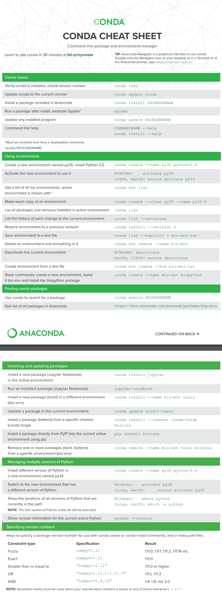

## 概述

除非需要安装pytorch低版本，仅有conda安装，否则绝对不使用conda

- 模块不完整
- 源配置太复杂，有问题

#### 与pip

conda是类似于pip的包管理工具，但可以管理python解释器和虚拟环境

- 即conda = python + pip + virtualenv
- 且每个虚拟环境可以使用不同版本的python解释器
- conda创建虚拟环境时，是在线获取解释器，而不是使用本地解释器，比较麻烦
- 除了整合了python各版本和虚拟环境外，可以安装除了python包以外语言的模块，如r语言。。

虚拟环境中的pip

- conda环境中的python和pip用的就是conda环境中的，而不是外部的


## centos

### 安装

下载

```bash
wget https://repo.continuum.io/miniconda/Miniconda3-latest-Linux-x86_64.sh
```

安装

```bash
# 安装提示安装即可
sh Miniconda3-latest-Linux-x86_64.sh
```

生效环境变量

```bash
source /root/.bashrc
```

完成

```bash
conda -V
```


### 镜像源

不用额外配置，直接用默认即可


## windows

！不要在windows上用conda

windows上使用conda有诸多问题

要使用conda，在linux上用

### 安装

- 下载windows版本的安装即可：[地址](https://docs.conda.io/en/latest/miniconda.html)
- 将`miniconda3\Scripts`目录加入环境变量
- 注：不要安装在路径中有空格的目录下，如Program Files


### 镜像源

- 查看镜像源

  ```python
  conda config --show channels	# 查看channel
  conda config --show-sources		# 查看具体信息，源地址
  ```

- 添加：使用命令

  ```python
  conda config --add channels http://mirrors.ustc.edu.cn/anaconda/pkgs/free/ 
  ```

- 添加：更改`.condarc`文件

  ```python
  # 清华源
  http://mirror.tuna.tsinghua.edu.cn/help/anaconda/
  复制其中的内容，覆盖.condarc文件即可
  
  # 命令行下使用时无法使用https，需要将源地址的https改为http
  ```

- 删除

  ```python
  conda config --remove channels "https://mirrors.ustc.edu.cn/anaconda/pkgs/free/"
  ```

- 切换回默认源defaults

  - 删除掉`.condarc`中的内容
  - 配置

  ```python
  conda config --remove-key channels
  ```

#### 清华源

- 删除原来的全部

- 清华源的https改为http，否则报错

- 配置一个就可以：`http://mirrors.tuna.tsinghua.edu.cn/anaconda/pkgs/main/`

- 再配置一个conda-forge

- 最终：(测试可用)

  ```python
  channels:
    - conda-forge
    - http://mirrors.tuna.tsinghua.edu.cn/anaconda/pkgs/main/
  show_channel_urls: true
  channel_priority: strict
  ```

- 源

  ```bash
  channels:
    - http://mirrors.tuna.tsinghua.edu.cn/anaconda/cloud/conda-forge/win-64/
    - http://mirrors.ustc.edu.cn/anaconda/pkgs/free/win-64
    - http://mirrors.tuna.tsinghua.edu.cn/anaconda/pkgs/main/win-64
  show_channel_urls: true
  ssl_verify: false
  
  channels:
    - http://mirrors.tuna.tsinghua.edu.cn/anaconda/pkgs/free/win-64/
    - http://mirrors.tuna.tsinghua.edu.cn/anaconda/pkgs/main/win-64/
  show_channel_urls: true
  ssl_verify: false
  ```

  

## 使用

### 常用命令

```python
conda list	# 当前环境下安装的模块
conda env list	# 查看虚拟环境列表

conda install package-name	# 安装模块
conda install package-name -c channels	# 指定安装源，先用search查看要用的源，再用config --show chaneels查看源具体的路径
conda update packname	# 更新模块
conda remove package-name	# 删除模块

conda search XXX -info # 搜索模块，查看模块依赖
```


安装requirements.txt

- 进入虚拟环境，这是用的pip就是conda虚拟环境中的，直接安装即可


#### 虚拟环境命令

- 创建的虚拟环境在miniconda目录的envs文件夹下

```python
# 创建虚拟环境
conda create -n 虚拟环境名称 python=3.6(指定解释器版本)

# 查看虚拟环境列表
conda env list	

# 进入虚拟环境
activate env-name (windows下)
conda activate env-name (linux下)

# 退出虚拟环境
conda deactivate env-name

# 删除虚拟环境
conda remove -n 虚拟环境 -all	# 删除所有模块及其虚拟环境
```


### 无模块问题

去pypi官网下载源码

wheel安装

- pip install xxx.whl

或源码安装

- python setup.py build
- python setup.py install


---

### 速查表

