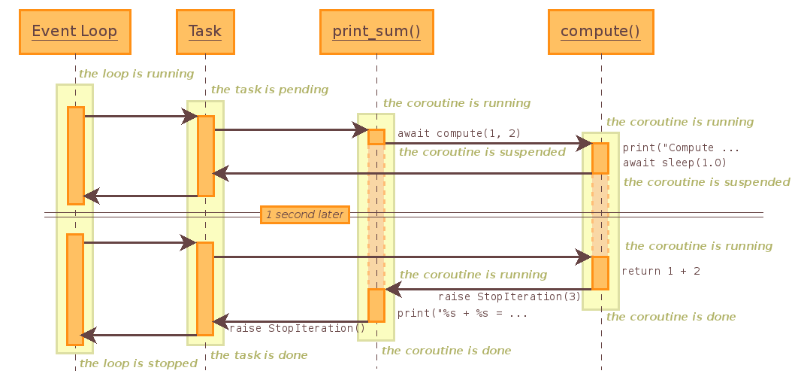

## [asyncio模块](https://docs.python.org/3.6/library/asyncio.html )

- 参考：

  - [Python黑魔法 --- 异步IO（ asyncio） 协程](https://www.jianshu.com/p/b5e347b3a17c )，jie'ch
  - [asyncio并发编程](https://www.jianshu.com/p/27f214de1ae2)

  

### 概述

- 异步的概念：
  - 与同步对应，解决的是堵塞在一个任务上的问题
  - 多线程、多进程、跳过+回调+eventloop（IO多路复用）都是实现的异步的不同方案

- asyncio采用的是```跳过+回调+eventloop```方式

- 只是针对多个协程间的并行，嵌套协程属于一个协程；（即协程内部的await coroutine不会加入到eventloop中）
- eventloop基于I/O多路复用


### 事件循环（eventloop）

- 程序开启一个无限的循环，程序员会把一些函数注册到事件循环上。当满足事件发生的时候，调用相应的协程函数 

- 创建：asyncio.get_event_loop()

- 方法：
  - stop()：停止事件循环

- asyncio提供两种eventloop

  - [`SelectorEventLoop`](https://docs.python.org/3.6/library/asyncio-eventloops.html#asyncio.SelectorEventLoop) ：基于[`selectors`](https://docs.python.org/3.6/library/selectors.html#module-selectors) 模块（High-level I/O multiplexing）

  - [`ProactorEventLoop`](https://docs.python.org/3.6/library/asyncio-eventloops.html#asyncio.ProactorEventLoop) ：`asyncio.ProactorEventLoop`类，仅适用于windows系统


### 协程（[coroutine](https://docs.python.org/3.6/library/asyncio-task.html)）

- 协程对象，指一个使用async关键字定义的函数，它的调用不会立即执行函数，而是会返回一个协程对象。协程对象需要注册到事件循环，由事件循环调用。

- 协程对象不能直接运行，在注册事件循环的时候，其实是run_until_complete方法将(coroutine)包装成为了一个任务（task）对象 

- 新旧两种声明方式：

  ```python
  # 1.使用以前的装饰器方式声明协程
  @asyncio.coroutine
  def func1():
      yield from asyncio.sleep(3)
  # func1()类型为generator，但不影响使用
  print(type(func1()))
  
  # 2.使用现在的async/await方式声明协程
  async def func2():
      for i in range(1, 11):
          print(i)
          await func1()
  # func2()类型为coroutine
  print(type(func2()))
  ```

- 执行： 

  - 单个协程：`loop.run_until_complete()`
  - 多个协程：`loop.run_until_complete(asyncio.wait(task_list))`

  ```python
  import asyncio
  
  async def hello_world():
      print("Hello World!")
  
  # 仅返回协程对象，不执行
  coroutine1 = hello_world()
  loop = asyncio.get_event_loop()
  # block call，堵塞
  # Blocking call which returns when the hello_world() coroutine is done
  # 即run_until_complete方法是堵塞的
  loop.run_until_complete(coroutine1)
  loop.close()
  ```

- 协程嵌套

  ```python
  import asyncio
  
  async def compute(x, y):
      print("Compute %s + %s ..." % (x, y))
      await asyncio.sleep(1.0)
      return x + y
  
  async def print_sum(x, y):
      result = await compute(x, y)
      print("%s + %s = %s" % (x, y, result))
  
  loop = asyncio.get_event_loop()
  loop.run_until_complete(print_sum(1, 2))
  loop.close()
  ```

  - 图解：

  


### await

- 挂起当前协程，切换到下一个协程

- 挂起：future对象、协程对象

  ```python
  # 挂起future对象，直到被完成或抛出异常
  result = await future
  # 挂起协程，等待此协程的返回；协程表达式(await coroutine)必须是对另外一个协程的调用
  result = await coroutine
  
  # GatheringFuture
  restult = await asyncio.gather(*tasks)
  ```
  


### 任务（Task）

- 一个协程对象就是一个原生可以挂起的函数，任务则是对协程进一步封装，其中包含任务的各种状态。

- 是Future的子类

- 创建任务：

  - ```asyncio.ensure_future(coroutine)```
  - ```loop.create_task(coroutine)``` 

- 执行结果：

  - task.result()，即为协程返回的数据

- 四种状态：Pending Running Done Cancelled 

  - 创建future的时候，task为pending，事件循环调用执行的时候当然就是running，调用完毕自然就是done，如果需要停止事件循环，就需要先把task取消 

  - 手动停止：task.cancel()

    ```python
    for task in asyncio.Task.all_tasks():
            print(task.cancel())	# 返回True表示cannel成功
    ```

    

  

### Future

- 代表将来执行或没有执行的任务的结果。它和Task上没有本质的区别
- Task是Future的子类


### 绑定回调

- task.add_done_callback(callback方法)

  ```python
  # 回调的最后一个参数是future对象，创建的task和这里的future对象，实际上是同一个对象(id一致)
  def callback(i, future):
      print('Callback: ', future.result())
  
  coroutine = do_some_work(2)
  loop = asyncio.get_event_loop()
  task = asyncio.ensure_future(coroutine)
  # 给task绑定回调方法
  task.add_done_callback(callback)
  loop.run_until_complete(task)
  ```


### 不同线程的事件循环

- 主线程中创建一个new_loop，然后在另外的子线程中开启一个无限事件循环。主线程通过run_coroutine_threadsafe新注册协程对象。这样就能在子线程中进行事件循环的并发操作，同时主线程又不会被block

- asyncio.run_coroutine_threadsafe(coroutine, eventloop)

  


### 方法

- loop.run_until_complete(future)
  - 参数：Future对象（task是Future的子类 ），下面两个返回Future对象
    - asyncio.wait(tasks) 
      - Returns two sets of Future: (done, pending).
      - 当传入一个协程，其内部会自动封装成task
    - asyncio.gather(*tasks)
      - Return a future aggregating results from the given coroutines or futures.
      - 当传入一个协程，会被封装成Future
- asyncio.gather(**coros_or_futures*)
  - 参数：协程或future
  - 返回：协程/future的执行结果，为GatheringFuture对象，是future的子类
  - 使用：
    - 启动事件循环：asyncio.get_event_loop(asyncio.gather(**coros_or_futures*))
    - 协程嵌套：result  = await asyncio.gather(**coros_or_futures*)
- asyncio.wait(futures)
  - 参数：task列表
  - 返回：done集合、pending集合
  - 使用：
    - 启动事件循环：asyncio.get_event_loop(asyncio.wait(futures))
    - 协程嵌套：done, pending = await asyncio.wait(futures)
- asyncio.run_coroutine_threadsafe(coroutine, eventloop)


