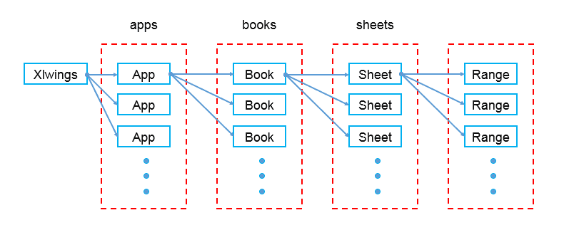
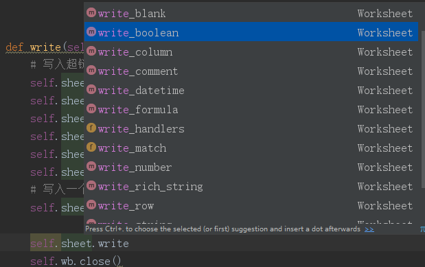
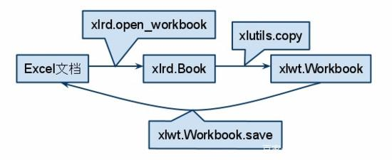

[Working with Excel Files in Python](http://www.python-excel.org/)


### 概述

- 搜索数量对比

  


### [各模块对比](https://www.jianshu.com/p/be1ed0c5218e)

- 平台支持情况

  

- 功能对比

  

- 性能对比

    - 读写均支持：xlwings和openpyxl，其中xlwings效率更高

    

- 总体支持情况

    


### openpyxl（推荐使用）

- 支持读取已有的和创建新的
- 特点：**不需要excel软件，仅支持.xlsx格式**
- 样式：支持写入
- load_workbook()打开已有的excel，可以修改，可以保存
    - 在原excel打开的情况下，也可以进行读取
- create_sheet()创建新的excel，最后保存


### [xlwings](https://www.kancloud.cn/gnefnuy/xlwings-docs/1127455)

- 支持读取已有的和创建新的

- 特点：**依赖于pywin32，需要安装有excel软件，支持.xls和.xlsx格式** 

- 样式：支持写入

- excel对象结构

  

  

### xlsxwriter

- 仅支持创建新的，不能读取已有的

- 样式：支持写入，且支持多种格式写入

  


### xlrd & xlwt & xlutils

- 之间的关系



- **xlutils**
  - 主要作用是充当xlrd和xlwt之间的桥梁，```from xlutils.copy import copy```
  - 使用copy复制xlrd读取的内容，进行更改
  - 只支持xls，不支持xlsx
  - 会丢失格式样式
- **xlrd**
    - 仅用于读取excel，即读取出来的内容是不能操作更改的
    - 支持读取xls和xlsx
- **xlwt**
    - 仅用于写入excel
    - 仅支持写入到xls，不支持xlsx
    - 只支持写入单元格，不支持写入一行
    - 使用xlutils写入xlsx


### pandas

- 支持读取和写入，但读取只读取数据会丢失样式
- 可以在文件打开时读取文件
- 


### 总结

- 使用openpyxl或xlwings
- openpyxl好像更受欢迎，搜索结果更多意味着有更广泛的使用
- 但xlwings执行效率高，也支持读写